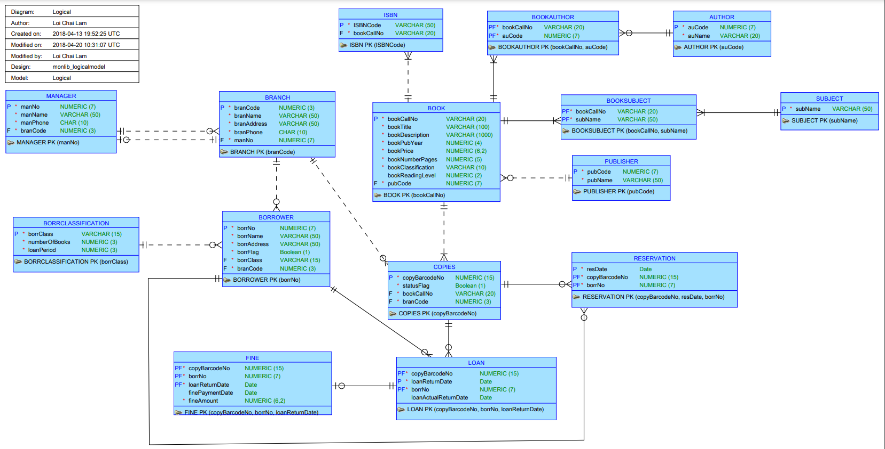

# Database: MonLib Database Design & Implementation

This repository contains the database structure design and implementation during my university studies. 

## Overview: 

The Monash Library Services Database is being developed to streamline the operations of the library system serving the residents of Monash Municipality. This database aims to efficiently manage various aspects of library operations, including branch management, borrower registration, book loans, reserves, fines, and more. 

## Requirements Overview:

1. **Branch & Manager Management:** 
   - For each branch Monash Library Services assigns a branch code (an incremental number for each branch with the first branch using a code of 100). The branch name, address and contact phone number are also recorded. Each branch is assigned a manager. Due to the small size of some of the branches a particular manager may manage several branches. Each manager is assigned a manger id. Monash Library Services record a managers name and contact phone number. All managers are assigned one particular branch as their home branch.

2. **Borrower Registration:** 
   - The system will allow for the registration of borrowers, capturing details such as borrower number, name, address, and their designated home branch. When a borrower first registers to borrow books the branch where they register is recorded as their home branch.

4. **Book Cataloguing:** 
   - The information held about a title is its Dewey Decimal call no (20 characters) - this call no is used
   to identify a particular title and for shelving books. A title may cover a number of different subjects, which the library wishes to record so that borrowers can use an online catalogue system to select books by subject as well as title and
   author's name.   

   - Detailed information about each book in the library will be recorded, including title, author(s), publisher, publication year, ISBN (a given title may have several ISBN's), purchase price, classification (reference or fiction), and number of pages. For fiction titles, reading levels will also be recorded  as an integer from 1 (Easy) to 30 (Very Difficult). A given title may be written by a number of different authors, however the library regards a title as only being published by a single publisher. 

5. **Loan Management:** 
   - The database maintains records of current loans of books to borrowers. It will manage current loans of books to borrowers, including loan dates, return dates, actual return dates, fine amounts, and payment dates. It will enforce loan limits and periods based on borrower classification (Junior, Adult, Organization).

6. **Counter Reserves:** 
   - Some book copies are placed on counter reserve, and are not available for loan - they may only be used in the library. A flag is added to a book to indicate if it is on counter reserve or not. There may also be other copies of the same title which are available for normal loan.

7. **Reserves:** 
   - Borrowers will be able to reserve books currently on loan, with the system recording the reserve date and time. A given book may be reserved by several borrowers, the book is made available based on the order in which the reserve was placed by the borrower.

7. **Renewals:** 
   - Borrowers will have the option to renew their loans upon returning a book, provided they are not flagged for further borrowings and the book has not been reserved by another borrower.

8. **Fines and Flags:** 
   - The system will generate fine notices for overdue books and record fine payments. Special borrower status flags will be maintained to prevent further borrowings for borrowers with overdue books, reached loan limits, or unpaid fines.

## Assumptions:
1. The author entity can exist independently in the database system, which means the
author who does not write any books can exist in the library database.
2. The publisher can exist independently in the database system, which means the
publisher who does not publish any books can exist in the library database.
3. A manager can have zero to many branches because he/she must have one home
branch.
4. Assume the initial branch has zero borrowers.
5. Assume an initial branch can have zero copy of books.
6. The COPY entity in the normalisation is equal to the COPIES entity in the ER and logical
diagram.
7. The IDENTIFIER entity in the normalisation is equal to the ISBN entity in the ER and
logical diagram.

## ERD Logical Diagram:

## Documentations:
The UML, ERD, Conceptual and Logical Diagram of the Database and the normalization to 3NF for the data have been included in the `doc` folder.

## Artifacts:
Oracle Data Modeller has been used to create the logical Model. The Oracle Data Modeler Project is placed in `Oracle Data Modeler Project` folder.

